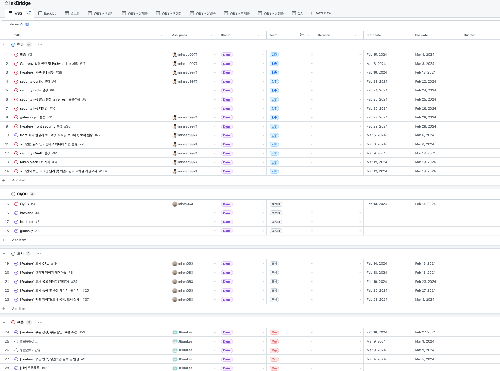
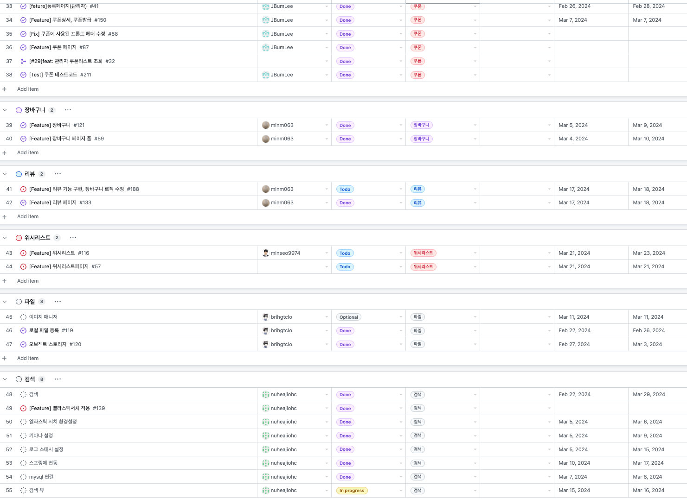
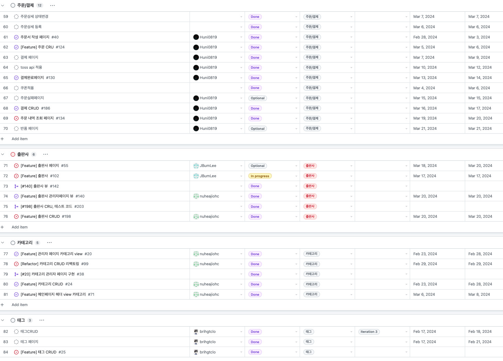
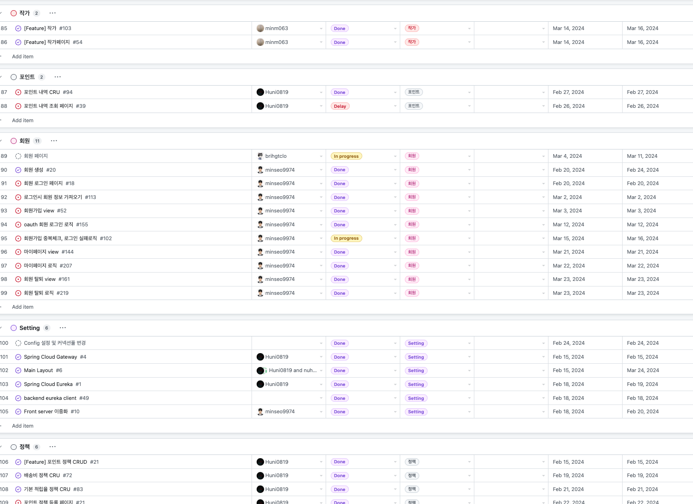
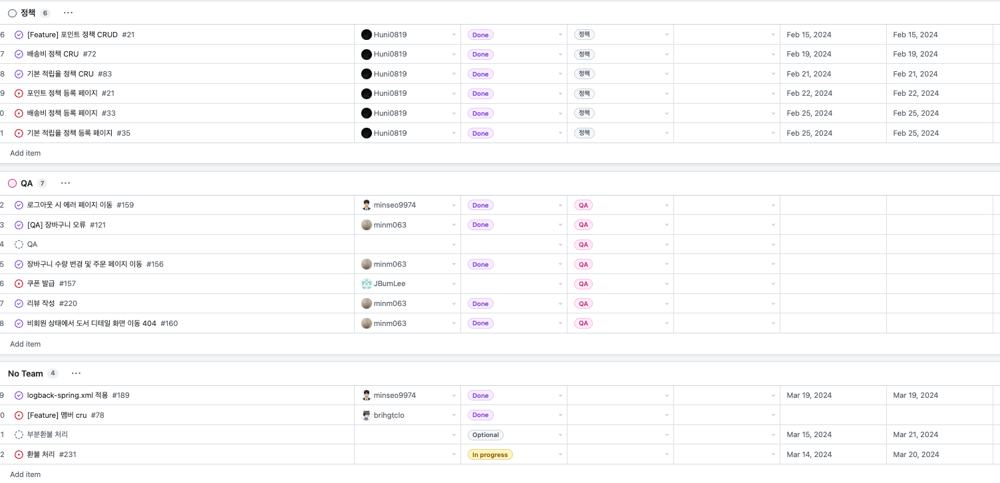

# 📖 인터넷 서점 InkBridge

- 배포 URL : https://www.inkbridge.store
- Test ID : user@inkbridge.com
- Test PW : Test123!

 

## 프로젝트 소개

- 고객이 책을 검색하고 주문할 수 있는 인터넷 서점입니다.
- 판매자는 판매하고 싶은 책을 등록할 수 있습니다.
- 검색을 통해 원하시는 제목 또는 내용의 책을 구경할 수 있습니다.
- 회원 또는 비회원으로 원하시는 책을 골라 장바구니에 담고 주문할 수 있습니다.

 

## 팀원 구성

  
| <a href="https://github.com/minseo9974"> 이민서</a> | <a href="https://github.com/nuheajiohc"> 최재훈</a> | <a href="https://github.com/minm063"> 장민주</a> |<a href="https://github.com/JBumLee"> 이정범</a> |<a href ="https://github.com/Huni0819">  장재훈</a> | <a href="https://github.com/brihgtclo"> 정병훈</a> | <a href="https://github.com/uasaha"> 여운석(TA)</a>
|-----|-----|-----|----|-----|------|-----|
  

 

## 아키텍처 구조

## 개발 환경

- 버전 및 이슈관리 : Github, Github Issues, Github Project
- 협업 툴 : Dooray, Notion, Github Wiki
- 서비스 배포 환경 : Nhn Cloud
- 디자인 : [Figma](https://www.figma.com/file/AH7UFpxhWSk7jSt0a0JONY/Ink-Bridge?type=design&node-id=0-1&mode=design&t=McQHargAgtQk4Vgo-0)
- [컨벤션](https://devminseo.notion.site/InkBridge-b521a2123e024836a7c2f0caddd02ee2?pvs=4)
   

## 브랜치 전략

### 브랜치 전략

- Git-flow 전략을 기반으로 main, develop 브랜치와 feature 보조 브랜치를 운용했습니다.
- main, develop, Feat 브랜치로 나누어 개발을 하였습니다.
  - **main** 브랜치는 배포 단계에서만 사용하는 브랜치입니다.
  - **develop** 브랜치는 개발 단계에서 git-flow의 master 역할을 하는 브랜치입니다.
  - **Feature** 브랜치는 기능 단위로 독립적인 개발 환경을 위하여 사용하고 네이밍은 각 이슈번호를 사용했습니다.

 

## 역할 분담

### 이민서

 
    
### 장재훈

 

### 장민주

 

### 최재훈

 

### 이정범

 

### 정병훈

 

## 개발 기간 및 작업 관리

### 개발 기간

- 전체 개발 기간 : 2024-02-05 ~ 2024-03-29

 

### 작업 관리

- GitHub Projects와 Issues를 사용하여 진행 상황을 공유했습니다.
- 매일 스크럼 회의를 진행하며 작업 순서와 방향성에 대한 고민을 나누고 GitHub project에 회의 내용을 기록했습니다.
  

 

WBS

    
    
    
    
    

 

### 테스트 커버리지

 

### 기술 스택

 
